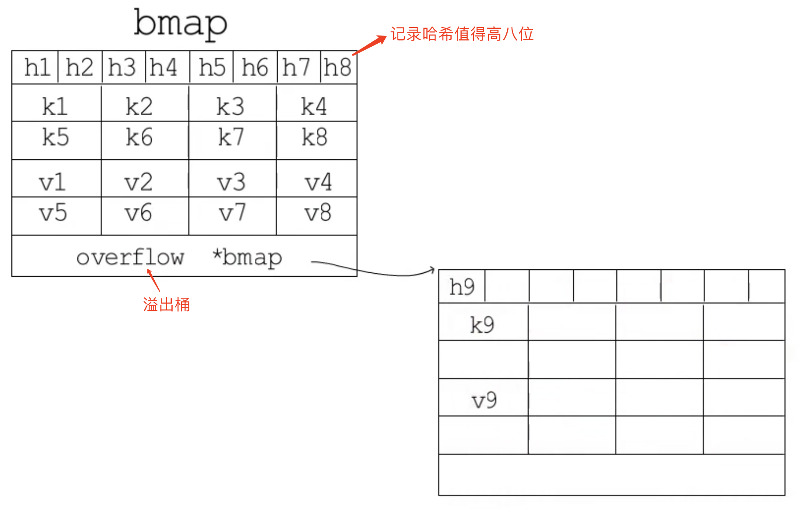

### hmap:
```go
// A header for a Go map.
type hmap struct {
	// Note: the format of the hmap is also encoded in cmd/compile/internal/reflectdata/reflect.go.
	// Make sure this stays in sync with the compiler's definition.
	count     int // hmap中存储的元素个数
	flags     uint8
	B         uint8  // 桶的数量 = 2^B
	noverflow uint16 // 溢出桶的数量
	hash0     uint32 // hash seed

	buckets    unsafe.Pointer // 指向桶的位置，存储的是bmap数组头元素的指针
	oldbuckets unsafe.Pointer // 扩容期间，旧桶的位置
	nevacuate  uintptr        // 下次要迁移的桶

	extra *mapextra // optional fields
}

// A bucket for a Go map.
type bmap struct {
    // tophash generally contains the top byte of the hash value
    // for each key in this bucket. If tophash[0] < minTopHash,
    // tophash[0] is a bucket evacuation state instead.
    tophash [bucketCnt]uint8 // bucketCnt = 8
    // Followed by bucketCnt keys and then bucketCnt elems.
    // NOTE: packing all the keys together and then all the elems together makes the
    // code a bit more complicated than alternating key/elem/key/elem/... but it allows
    // us to eliminate padding which would be needed for, e.g., map[int64]int8.
    // Followed by an overflow pointer.
}
```
特点：
- 使用与运算的方法选择桶[hash & (m -1)， 其中m = $2^B$]
- 渐进式扩容

参数设置：
- 负载因子(count / $2^B$)：6.5
- 超过负载因子时，翻倍扩容: B + 1
- 溢出桶数(noverflow)过多（当B<=15时，noverflow >= $2^B$；当B>15时，如果noverflow >= $2^{15}$）,等量扩容（当频繁删除元素之后，一般会造成负载因子不大，但是溢出桶很多，这时就会触发等量扩容，将元素排列的更加紧密且减少溢出桶的数量）

其他：

- bmap的结构示意图：

  