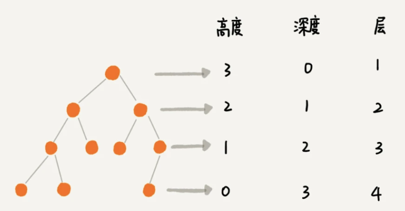

### 散列表

散列表是在数组数据结构之上，能够在查找、插入、删除操作上实现O(1)的时间复杂度。 其要解决的两个核心问题是：

- 散列函数的设计：好的散列函数设计能够降低散列冲突的情况，从而提升散列表的性能；其设计要求如下：
    - 散列函数不能太复杂：复杂的散列函数势必消耗很多的计算
    - 散列函数生成的值要尽可能的随机且分布均匀
- 散列冲突解决
    - 开放寻址法：适用于数据量比较小、装载因子小的时候。eg: ThreadLocalMap
        - 线性探测
        - 二次探测
        - 双重探测
    - 链表法: 适用于存储大对象(因为链表中的指针是要消耗内存的，如果存储小对象，指针占用的内存空间就不能忽视了)、大数据量的散列表。支持更改灵活的优化策略，比如用红黑树替代链表，比如java的HashMap

概念：

- 装载因子：填入表中的元素个数 / 散列表的长度

### 树

#### 概念

- 度: 一个节点含有的子树数量
- 节点的高度：节点到叶子节点的最大边数
- 节点的深度：节点到根节点的最大边数
- 节点的层数：节点的深度 + 1
- 树的高度：根节点的高度

#### 分类

- 满二叉树: 如果所有分支节点存在左子树和右子树，并且所有叶子都在同一层。
- 完全二叉树: 对一颗具有n个节点的二叉树按层序编号，如果编号为i(1< n <= n)的节点与同样深度的满二叉树中编号为i的节点在二叉树中的位置相同，即为完全二叉树。
> 满二叉树、完全二叉树可以使用数组存储元素

#### 二叉树的性质:

- 在二叉树的第i层上至多有2^(i-1)个结点;
- 深度为k的二叉树至多有2^k - 1个结点;
- 对于任何一个二叉树T，如果叶子节点数为j, 度为2的结点数为k，这j = k + 1

       